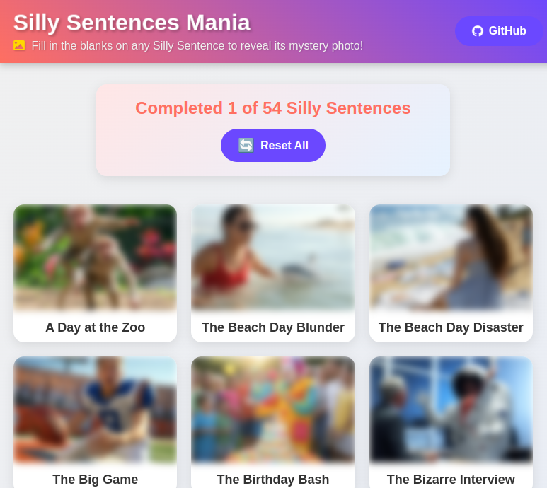

# Silly Sentences



**Silly Sentences** is a fun and interactive web application inspired by the classic Mad Libs game. Users can complete a variety of silly sentences by filling in the blanks with their own words, creating hilarious and creative stories. The application features a vibrant design, completion tracking, and a reset option for replayability.

This project was an exercise of playing with Grok 3. Most of this project was generate via Grok 3 prompts. This includes the images.

---

## Table of Contents

- [Features](#features)
- [Setup](#setup)
- [Usage](#usage)
- [Completion Status and Reset](#completion-status-and-reset)
- [Styling and Design](#styling-and-design)
- [Known Issues](#known-issues)
- [Future Improvements](#future-improvements)
- [Credits](#credits)

---

## Features

- **Interactive Silly Sentences**: Users can complete multiple silly sentences by providing words that fit into predefined categories (e.g., noun, verb, adjective).
- **Completion Tracking**: The application tracks which silly sentences have been completed and displays a completion status (e.g., "Completed 3 of 50 Silly Sentences").
- **Reset Functionality**: A reset button allows users to clear all completion data and start over.
- **Responsive Design**: The application is fully responsive and works well on both desktop and mobile devices.
- **Playful Styling**: Features vibrant colors, gradients, and animations to create an engaging user experience.

---

## Setup

To run the Silly Sentences project locally, follow these steps:

1. **Clone the Repository**:
   ```bash
   git clone https://github.com/tompetersjr/silly-sentences.git
   ```
2. **Navigate to the Project Directory:**
   ```bash
   cd silly-sentences
   ```
3. **Serve the Project:** Since this is a client-side application, you can use a static server to host the files. Here are a few options:
   - **VS Code Live Server:** If you're using Visual Studio Code, install the Live Server extension and click "Go Live" in the bottom right.
   - **Python Simple Server:** Run the following command in the project directory:
     ```bash
     python -m http.server
     ```
     Then, open http://localhost:8000 in your browser.
   - **Node.js http-server:** If you have Node.js installed, you can use http-server:
     ```bash
     npm install -g http-server
     http-server
     ```
     Then, open http://localhost:8080 in your browser.
4. **Open the Application:** Once the server is running, open your browser and navigate to the provided URL (e.g., http://localhost:8000).

--

## Usage

1. **Home Page:**
   - The home page displays a grid of silly sentence cards, each representing a different story.
   - Each card shows an image and the title of the silly sentence.
   - Images are blurred for uncompleted sentences and clear for completed ones.
2. **Completing a Silly Sentence:**
   - Click on a card to navigate to the silly sentence page.
   - Fill in the input fields with words that match the requested types (e.g., noun, verb).
   - Once all fields are filled, click the "Reveal" button to see the completed story.
   - The completed story will be displayed with your words inserted, and the image will be unblurred on the home page.
3. **Completion Status:**
   - The home page shows a completion status (e.g., "Completed 3 of 50 Silly Sentences") to track your progress.
   - This status is stored in the browser's local storage.
4. **Reset Progress:**
   - Click the "Reset All" button on the home page to clear all completion data.
   - This will reset the completion status to "Completed 0 of X" and blur all images again.

--

## Completion Status and Reset

- **Completion Tracking:** The application uses the browser's local storage to track which silly sentences have been completed. Each completed sentence is marked with a unique key (e.g., silly_sentence_1_completed).
- **Reset Button:** The reset button clears all completion data from local storage and reloads the page, resetting the completion status and blurring all images.

**Note:** Since local storage is used, completion data is tied to the browser and device. Clearing the browser's storage or using a different browser/device will result in a fresh start.

--

## Styling and Design

The Silly Sentences project features a playful and vibrant design to enhance the user experience:

- **Gradients and Colors:** The header and background use gradients for a dynamic look, with coral and purple accents for buttons and highlights.
- **Animations:** The title pulses gently, and cards slide in on load for a smooth entrance.
- **Responsive Layout:** The design adapts to different screen sizes, ensuring usability on both desktop and mobile devices.
- **Interactive Elements:** Buttons have hover and active states for feedback, and completed words in stories have a subtle pulse animation.

--

## Known Issues

- **Local Storage Limitations:** Completion data is stored in local storage, which has size limits and is cleared if the user deletes browser data.
- **Reset Clears All Data:** The reset button clears all completion data without confirmation. Future versions may include a confirmation prompt.

--

## Future Improvements

- **Cloud Sync:** Implement a way to save progress across devices using cloud storage or user accounts.
- **More Silly Sentences:** Expand the collection of silly sentences for more variety.
- **Custom Sentences:** Allow users to create and share their own silly sentences.
- **Confirmation for Reset:** Add a confirmation dialog before resetting progress to prevent accidental data loss.

--

## Credits

- **Grok 3**: Generation of most of the code and all of the images.
- **Design Inspiration:** The vibrant and playful design is inspired by classic word games like Mad Libs.
- **Development:** Built with HTML, CSS, and JavaScript, with a focus on interactivity and user engagement.
